# FamilyHub
Nowadays, social media is making it harder for families to stay close. Thus, our primary objective is to counteract this negative influence by establishing a dedicated social media platform designed exclusively for families. This platform aims to provide a secure space where family members can effortlessly share their interests, activities, and cherished memories, fostering a deeper and more meaningful connection among family members.

## Features

- **Family Circle Creation:**

    - Create a circle to group family members together.
    - Assign roles and permissions within the family circle.

-  **Sharing Functionality:**

    - Share feeds: Post updates, thoughts to the family circle.
    - Share images: Upload and share photos with family members.
    - Share events: Create and manage events within the family circle, these events are shown at a calendar.
    - Share to-do lists: Collaboratively create and manage to-do lists for tasks within the family.

- **User Authentication:**

    - User authentication system with features like login, signup, reset password, and forgot password functionality.
    - Secure user authentication to ensure privacy and data protection.

## Installation
To set up and run the FamilyHub application, follow these steps:
- clone family-hub repo: `git clone https://github.com/Sallmahussien/Family-Hub.git`
- navigate to Family-Hub directory: `cd Family-Hub`
- Install the dependencies: `npm install`
- setup mysql: `cat dev_setup_mysql.sql | mysql -u root -p`
- setup prisma:
	- update the schema: `npx prisma migrate dev --name init`
	- load the updated schema to client: `npx prisma generate`
- Run the app in development mode: `npm run dev`
- access the app from browser through: `http://localhost:3000/`

## Snapshots

### Homepage

---
### Registration

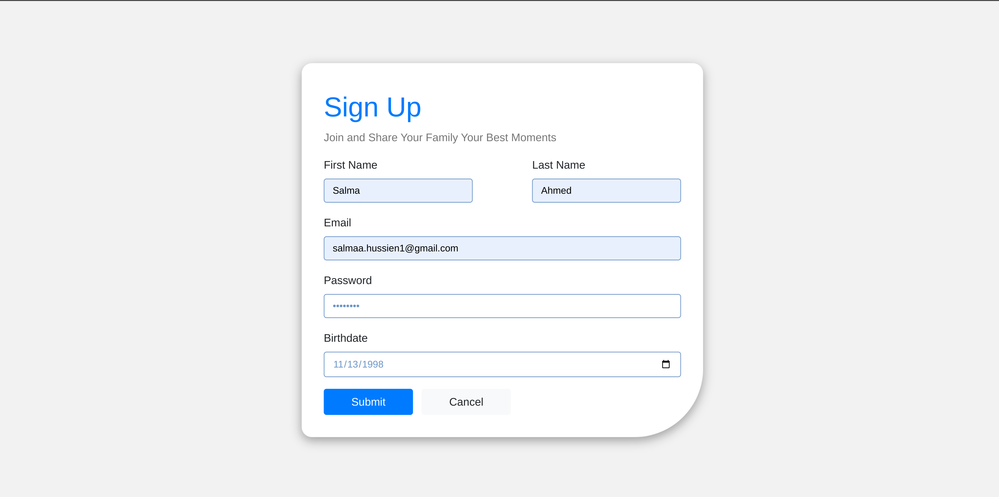
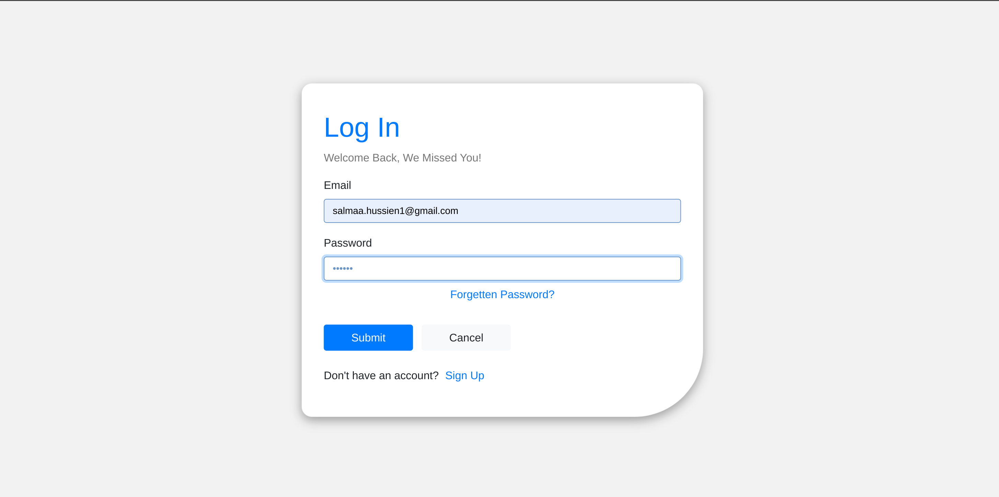
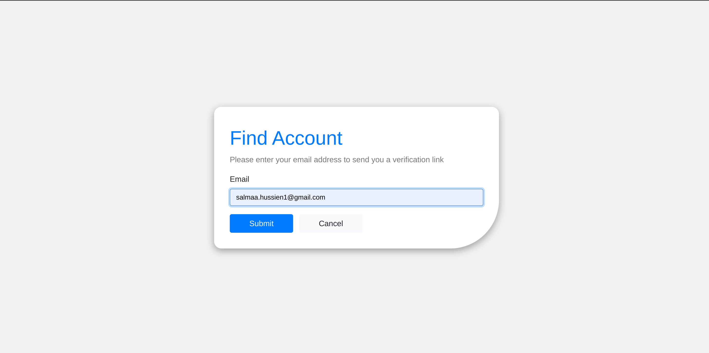
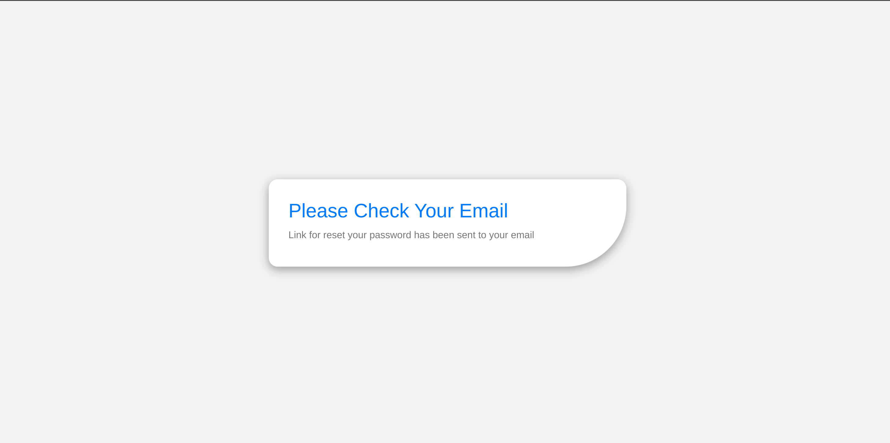

---
### Circle
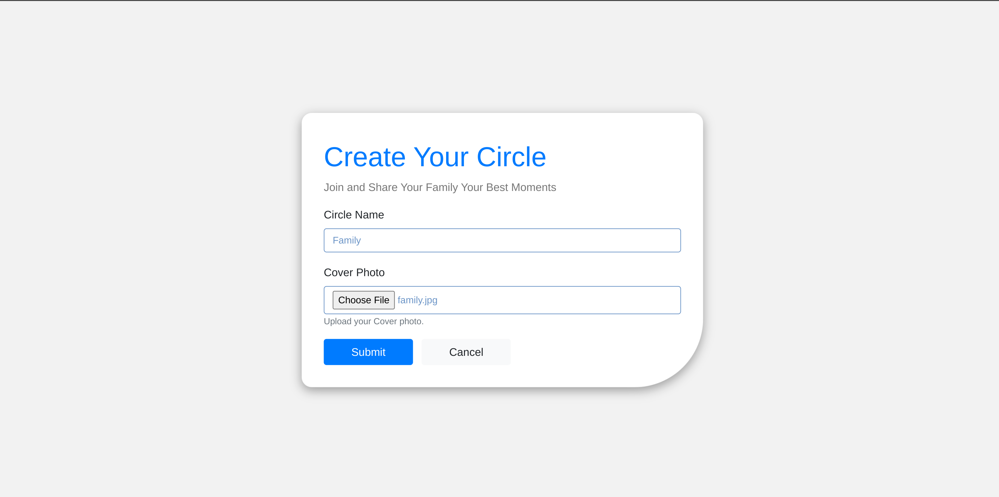

---
### News Feed

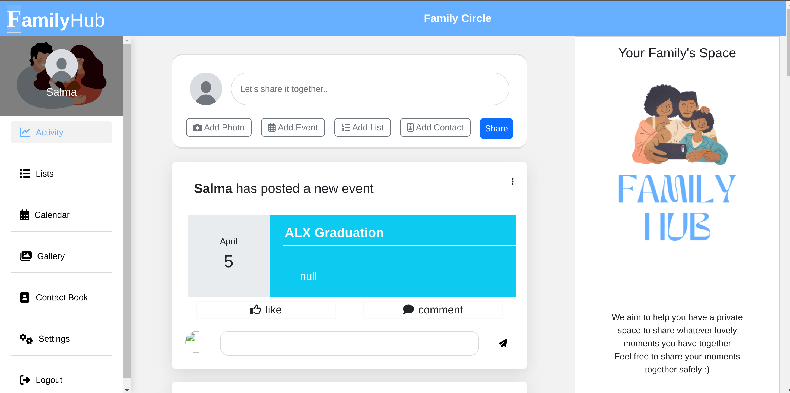

---
### Lists

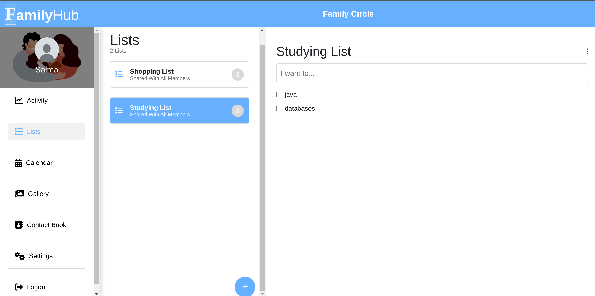
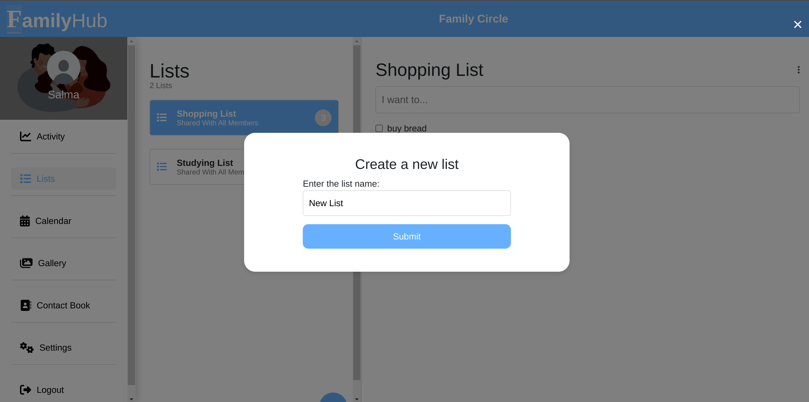

---
### Calendar

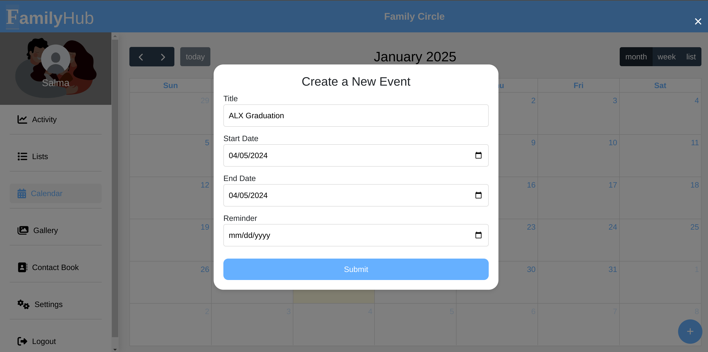
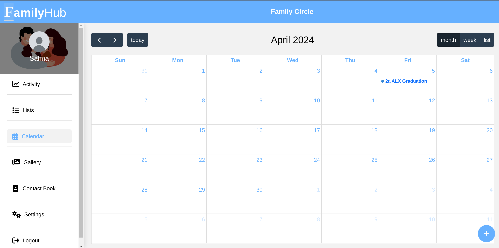

---
### Gallery

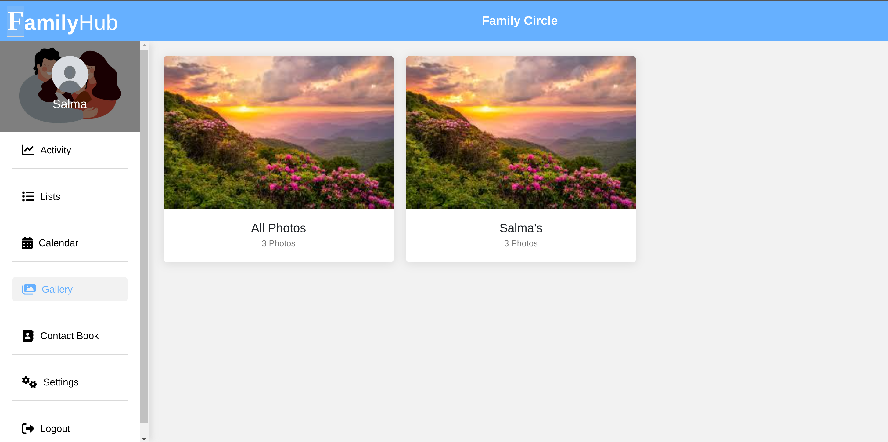
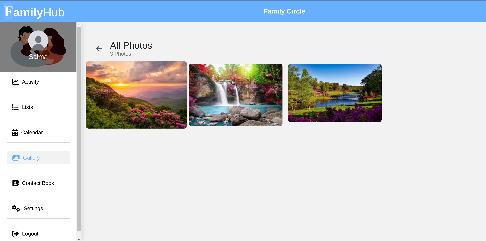
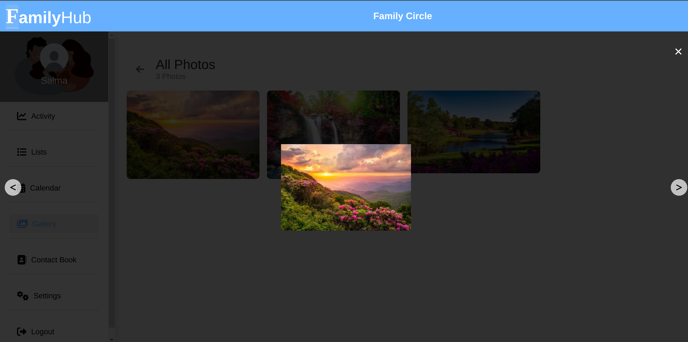

---
### Contact Book

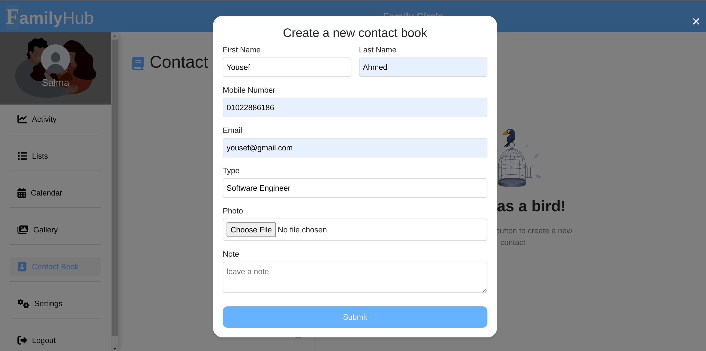
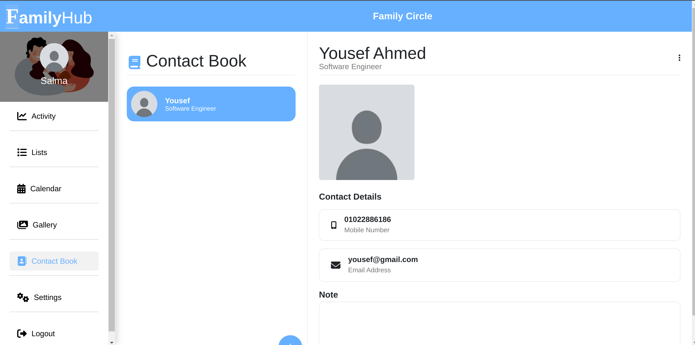
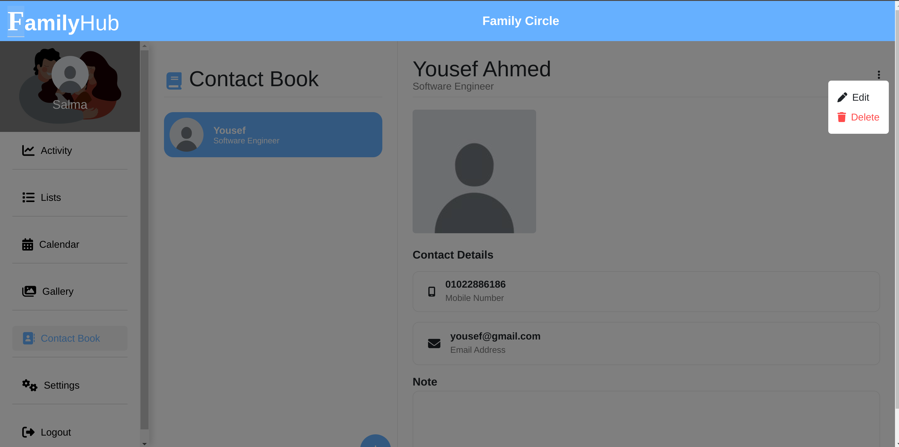
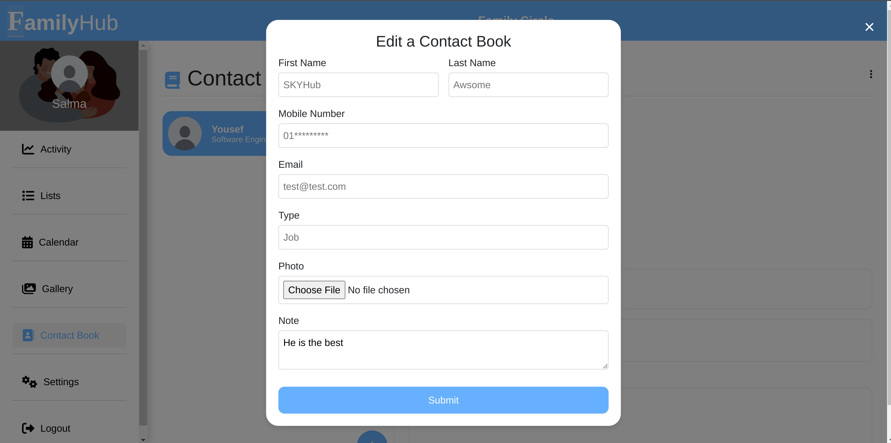

## Authors
- [Kholoud Fattem](https://github.com/Kholoudxs55kh)
- [Salma Hussien](https://github.com/Sallmahussien)
- [Yousef Ahmed](https://github.com/youssef-ahmmed)
